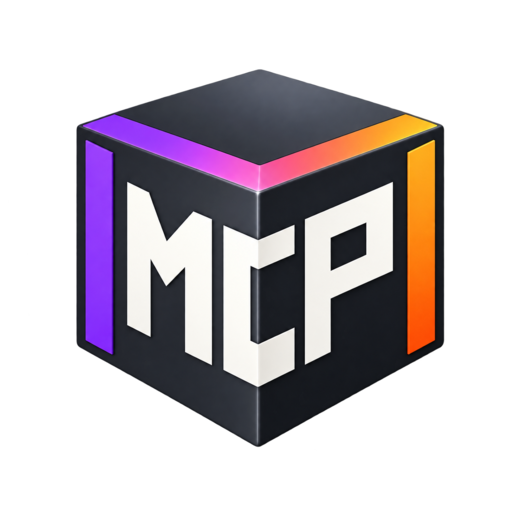

<p align="center">
  
</p>

<h1 align="center">UnityMCPBridge</h1>

**A personal Unity 6 bridge for dependable, inspectable agent automation.**

[Install](#install-a-matched-release) · [Documentation](docs/README.md) ·
[Tool catalog](docs/reference/tools/index.md) ·
[Releases](https://github.com/gitgomez/UnityMCPBridge/releases) ·
[Issues](https://github.com/gitgomez/UnityMCPBridge/issues) ·
[Security](SECURITY.md)

UnityMCPBridge connects MCP-capable assistants to the Unity Editor. The Unity
package exposes Editor operations; the matching Python server presents them as
MCP tools and resources. The two sides are released together and must use the
same revision.

This fork focuses on predictable behavior when an agent has to do more than
create a few assets: wait for the Editor, interact with runtime UI, survive
reloads, understand uncertain command outcomes, and recover without guessing.

## Built on CoplayDev's work

UnityMCPBridge exists because **CoplayDev and the contributors to
[CoplayDev/unity-mcp](https://github.com/CoplayDev/unity-mcp)** built the
original MCP for Unity project: its Unity package, Python server, transport
foundation, client integration, and broad tool surface are the base of this
fork. That work is used under the MIT License and deserves direct credit.

- Visit the [upstream repository](https://github.com/CoplayDev/unity-mcp) for
  the original project and its mainstream development line.
- See the [upstream contributors](https://github.com/CoplayDev/unity-mcp/graphs/contributors)
  and [upstream releases](https://github.com/CoplayDev/unity-mcp/releases).
- Read the upstream authors' publication,
  [*MCP-Unity: Protocol-Driven Framework for Interactive 3D Authoring*](https://doi.org/10.1145/3757376.3771417).
- See [THIRD_PARTY_NOTICES.md](THIRD_PARTY_NOTICES.md) for repository provenance
  and dependency-license boundaries.

This repository is an independent continuation, not an official CoplayDev
release channel. Fork-specific questions and bugs belong here; they should not
be redirected to CoplayDev as support requests.

The graphite MCP cube with purple and orange edges is the independent
UnityMCPBridge project mark. It replaces upstream branding in the package and
Editor windows; the upstream project remains prominently credited for the
technical foundation.

## Why this fork exists

Gomez maintains UnityMCPBridge for practical development needs that occur in
real projects. GPT- and Codex-based tools contribute substantially to design,
implementation, review, and documentation; Gomez reviews the work and remains
responsible for what is published.

The fork develops the bridge in three practical areas:

- **New and expanded tools:** `interact_play_mode` can inspect, wait for, and
  operate runtime uGUI and UI Toolkit without driving the operating-system
  mouse. Its bounded actions cover clicks, drag and scroll gestures, text and
  toggle input, UI Toolkit hover and key events, and state-based waiting.
  Camera tooling can capture the fully composited Game View, including runtime
  overlays, and the Python CLI exposes matching operations for repeatable use
  outside an MCP conversation.
- **Server and command-runtime extensions:** mutating requests receive durable
  receipts with explicit lifecycle states and stable identities across retries
  and reloads. Interrupted work is surfaced as `outcome_unknown` instead of
  being guessed successful or silently repeated. A separate administrative
  path reports ledger status and performs persistence-first cleanup while
  protecting active receipts and requiring special confirmation for uncertain
  outcomes.
- **Reliability and operator improvements:** Editor state reports whether the
  instance is actually ready for tools; refresh, script-reload, Play Mode, and
  UI waits are bounded and return observed state on failure. External Unity
  YAML changes are detected before unsafe refreshes, Editor saves produce
  receipts that let the server reconcile known writes, and composited capture
  makes visual verification closer to what the player sees. Repository-local
  contracts, generated references, and agent guidance keep documentation and
  live capability discovery tied to the implemented bridge.

The authoritative built-in surface is
[`Contracts/tool-contracts.v1.json`](Contracts/tool-contracts.v1.json). The
[fork guide](docs/getting-started/bridge-fork.md) explains the operational
differences in detail.

## Prerequisites

- Unity `6000.0` or newer; see the
  [compatibility matrix](docs/architecture/unity-compat.md) for the currently
  verified Unity 6 versions;
- Git; private mirrors additionally require credentials that Unity Package
  Manager can use;
- Python 3.10 or newer, managed through
  [`uv`](https://docs.astral.sh/uv/); and
- an MCP-capable client.

## Install a matched release

In Unity, open **Window → Package Manager → Add package from git URL** and use:

```text
https://github.com/gitgomez/UnityMCPBridge.git?path=/MCPForUnity#v10.2.7
```

The package selects the matching server source:

```text
git+https://github.com/gitgomez/UnityMCPBridge.git@v10.2.7#subdirectory=Server
```

Do not mix a fork package with the upstream PyPI server. Keep both URLs on the
same tag. For deliberate development snapshots, use `optimize/bridge` on both
sides as described in the [fork guide](docs/getting-started/bridge-fork.md#development-snapshots).

After installation, open **Window → MCP for Unity**, configure the detected
clients, start the chosen transport, and inspect the live capability set before
assuming that a command is available.

## System shape

```text
MCP client
    │
    ▼
Python server (Server/)
    │  WebSocket / HTTP / stdio transport
    ▼
Unity Editor package (MCPForUnity/)
    │
    ▼
Scenes, assets, scripts, tests, runtime UI
```

Useful entry points:

- [Installation and first connection](docs/getting-started/install.md)
- [Fork setup, capability map, and recovery](docs/getting-started/bridge-fork.md)
- [Unity compatibility](docs/architecture/unity-compat.md)
- [Transport architecture](docs/architecture/transports.md)
- [Troubleshooting](docs/guides/troubleshooting.md)
- [All 53 MCP tool entrypoints](docs/reference/tools/index.md)
- [CLI reference](docs/reference/cli.md)

## Contributions

Focused contributions are welcome, but this is not a community roadmap or a
support service. Read [CONTRIBUTING.md](CONTRIBUTING.md) before investing time:
fork development targets `optimize/bridge`, while `main` is the release line.
Changes meant for the general upstream project may be better proposed directly
to [CoplayDev/unity-mcp](https://github.com/CoplayDev/unity-mcp).

## Support and responsibility

UnityMCPBridge is maintained according to Gomez's needs and available time.
There is no guaranteed response time, release cadence, compatibility promise,
or obligation to accept or implement a request. See [SUPPORT.md](SUPPORT.md).

The project is not affiliated with, sponsored by, endorsed by, or supported by
Unity Technologies, CoplayDev, Anthropic, or OpenAI. OpenAI does not maintain
or support this fork.

## License

UnityMCPBridge is distributed under the [MIT License](LICENSE), without
warranty. Third-party notices and upstream provenance are recorded in
[THIRD_PARTY_NOTICES.md](THIRD_PARTY_NOTICES.md).
