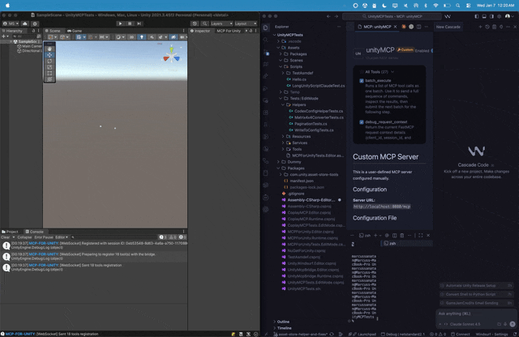

# Overview

MCP for Unity bridges AI assistants — Claude, Codex, VS Code, local LLMs, and more — with the Unity Editor via the [Model Context Protocol](https://modelcontextprotocol.io/introduction). Give your LLM the tools to manage assets, control scenes, edit scripts, run tests, and automate workflows.

## What you get

- **53 Unity Editor tools** exposed over MCP — `manage_scene`, `manage_script`, `manage_gameobject`, `manage_material`, `manage_physics`, `run_tests`, and more.
- **25+ read-only resources** for state introspection — `editor_state`, `gameobject_components`, `project_info`, `unity_instances`, etc.
- **Auto-configuration** for popular MCP clients — Claude Desktop, Claude Code, Cursor, VS Code, Windsurf, Cline, Codex, Qwen, Gemini CLI, Copilot CLI, OpenClaw.
- **Multi-instance support** — drive several Unity Editors from a single session via `set_active_instance`.
- **Two transports** — HTTP (multi-agent, default) and stdio (single-agent legacy).

## When you'd use it

- Prototype scenes and gameplay with natural language ("build a player controller with WASD and a double-jump").
- Generate and refactor C# scripts with full project context and validation.
- Automate repetitive editor tasks — bulk asset processing, scene validation, regression testing.
- Build custom AI-driven editor tools on top of the MCP protocol.

## Next steps

- **[Install](./install.md)** — Add the Unity package, install the Python server, and connect your first MCP client.
- **[UnityMCPBridge Fork](./bridge-fork.md)** — Install the matched fork package and server, then verify fork capabilities.
- **[Your First Prompt](./first-prompt.md)** — End-to-end "build me a red cube" tutorial.
- **[Choosing an MCP Client](./clients.md)** — A capability matrix across all supported clients.
- **Setup Wizard** — Opens after package import and remains available from **Window → MCP for Unity**.

---

MIT licensed. UnityMCPBridge is personally maintained by Gomez with substantial Codex and GPT assistance. It has no support commitment and is independent from and not endorsed by Unity Technologies, CoplayDev, Anthropic, or OpenAI. See the repository's [third-party notices](https://github.com/gitgomez/UnityMCPBridge/blob/main/THIRD_PARTY_NOTICES.md) for attribution and dependency-license information.
